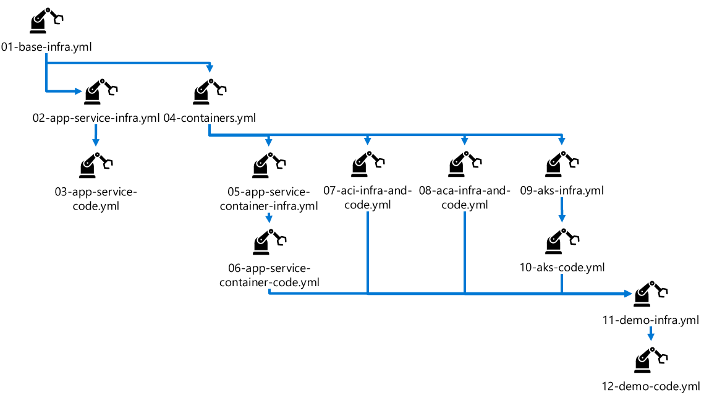

# Introduction

BoardGameNerd is site for board gaming enthusiasts to see the current hotness in board games.

## Projects

### BoardGameNerd.Shared

Lorem ipsum dolor sit amet, consectetur adipiscing elit. Nunc vestibulum massa id nisl malesuada, ut pretium massa commodo. Duis feugiat accumsan volutpat. Fusce id maximus ligula. Mauris faucibus posuere posuere. Donec eu fringilla turpis. Morbi egestas tellus eu laoreet scelerisque. Curabitur efficitur dolor ut tristique dictum.

### BoardGameNerd.Client

Lorem ipsum dolor sit amet, consectetur adipiscing elit. Nunc vestibulum massa id nisl malesuada, ut pretium massa commodo. Duis feugiat accumsan volutpat. Fusce id maximus ligula. Mauris faucibus posuere posuere. Donec eu fringilla turpis. Morbi egestas tellus eu laoreet scelerisque. Curabitur efficitur dolor ut tristique dictum.

### BoardGameNerd.Server

Lorem ipsum dolor sit amet, consectetur adipiscing elit. Nunc vestibulum massa id nisl malesuada, ut pretium massa commodo. Duis feugiat accumsan volutpat. Fusce id maximus ligula. Mauris faucibus posuere posuere. Donec eu fringilla turpis. Morbi egestas tellus eu laoreet scelerisque. Curabitur efficitur dolor ut tristique dictum.

## Setup

1. Create a Resource Group

```bash
az account set --subscription "{SUBSCRIPTION_ID}"

az group create -n "{RESOURCE_GROUP_NAME}" -l "{LOCATION}"
```

1. Create a Service Principal

See <https://docs.microsoft.com/en-us/dotnet/architecture/devops-for-aspnet-developers/actions-deploy#create-an-spn> for more information.

```bash
az ad sp create-for-rbac --name "{SERVICE_PRINCIPAL_NAME}" --sdk-auth --role contributor \
--scopes "/subscriptions/{SUBSCRIPTION_ID}/resourceGroups/{RESOURCE_GROUP_NAME}"
```

```json
{
  "clientId": "",
  "clientSecret": "",
  "subscriptionId": "",
  "tenantId": "",
  ...
}
```

Copy the output, this will be the value used for the GitHub secret `AZURE_CREDENTIALS`.

1. Add GitHub Secrets

In the GitHub portal add the following GitHub secrets:

* `AZURE_SUBSCRIPTION_ID` Your Azure Subscription ID
* `AZURE_CREDENTIALS` The output from the Create Service Principal step
* `ENV_FILE` The name of that holds the environment variables, e.g. `.github/workflows/.env`

You can do this in the GitHub Portal.

For more information on adding secrets see <https://cli.github.com/manual/gh_secret_set>.

1. Update `.env` File

Provide names for the Azure resources that will be created.

```text
RESOURCE_GROUP_NAME=
ACR_NAME=
ACR_LOGIN_SERVER=
ACR_SERVER_IMAGE_NAME=
ACR_CLIENT_IMAGE_NAME=
STORAGE_ACCOUNT_NAME=
DEMO_APP_NAME=
LOG_ANALYTICS_WORKSPACE_NAME=
APP_SERVICE_PLAN_NAME=
APP_SERVICE_SERVER_NAME=
APP_SERVICE_CLIENT_NAME=
APP_SERVICE_APP_INSIGHTS_NAME=
APP_SERVICE_CONTAINER_SERVER_NAME=
APP_SERVICE_CONTAINER_CLIENT_NAME=
APP_SERVICE_CONTAINER_APP_INSIGHTS_NAME=
ACI_SERVER_NAME=
ACI_CLIENT_NAME=
ACI_APP_INSIGHTS_NAME=
ACA_SERVER_NAME=
ACA_CLIENT_NAME=
ACA_APP_INSIGHTS_NAME=
ACA_KUBE_ENVIRONMENT_NAME=
AKS_NAME=
AKS_NAMESPACE=
AKS_PIP_NAME=
```

Save and commit your changes.

Here is a diagram of the pipeline dependencies & order of operations.



1. Deploy Base Infrastructure

From the GitHub Portal, select **Actions** from the Repository screen.

Select the **01-base-infra** workflow and select **Run workflow**.

1. Create GitHub Secret for Azure Container Registry Password

From the Azure Portal, Navigate to the **Azure Container Registry** created in the previous step.

Click **Access Keys**.

Copy one of the displayed passwords.

In the GitHub Portal add secret called `ACR_PASSWORD` and paste in the value copied in the previous step.

1. Run the **02-app-service-infra** workflow to deploy the infrastructure for hosting the web app & API on App Service, then run the **03-app-service-code** workflow to deploy the web app & API.

1. Run the **04-containers** workflow to build the web app & API images and store them in the Azure Container Registry.

1. Run the **05-app-service-container-infra** workflow to deploy the infrastructure for hosting the web app & API on App Service, then run the **06-app-service-container-code** workflow to deploy the web app & API.

1. Run the **07-aci-infra-and-code** workflow to deploy the infrastructure for hosting the web app & API on App Service & deploy the web app & API.

1. Run the **08-aca-infra-and-code** workflow to deploy the infrastructure for hosting the web app & API on App Service & deploy the web app & API.

1. Run the **09-aks-infra** workflow to deploy the infrastructure for hosting the web app & API on App Service, then run the **10-aks-code** workflow to deploy the web app & API.

1. Run the **11-demo-infra** workflow to deploy the infrastructure for hosting the demo web app & API on App Service, then run the **12-demo-code** workflow to deploy the demo web app & API.

### App Service

<https://docs.microsoft.com/en-us/dotnet/architecture/devops-for-aspnet-developers/actions-build>

<https://docs.microsoft.com/en-us/dotnet/architecture/devops-for-aspnet-developers/actions-deploy>

### App Service Container

<https://docs.microsoft.com/en-us/azure/container-instances/container-instances-github-action>

Thanks to <https://github.com/roberto-mardeni/azure-containers-demo> for the inspiration.
